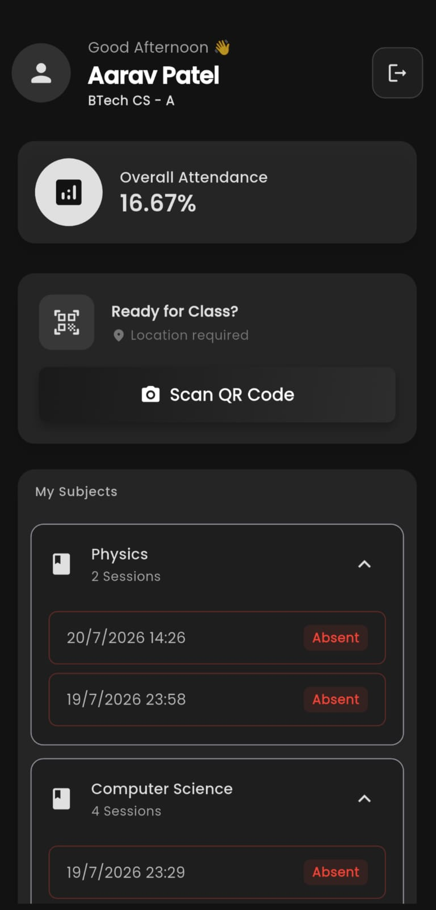
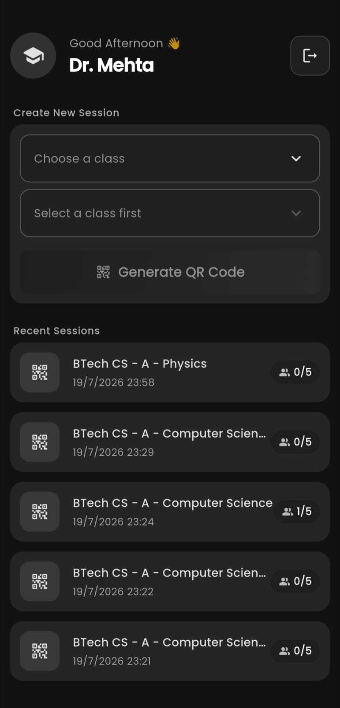
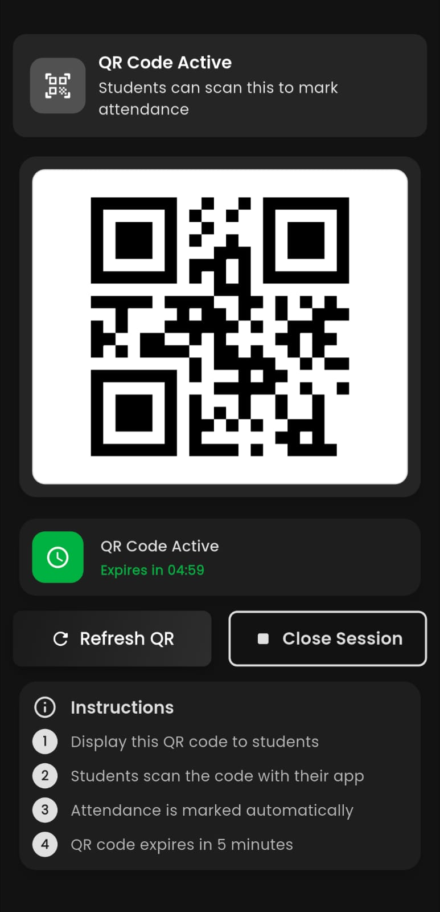
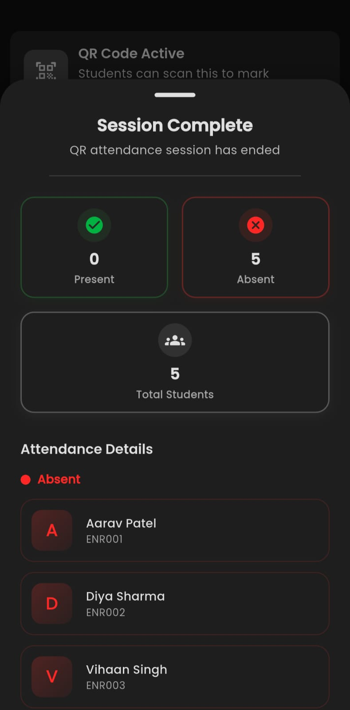
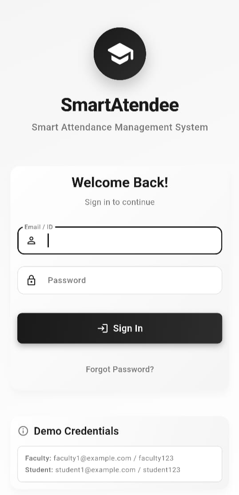
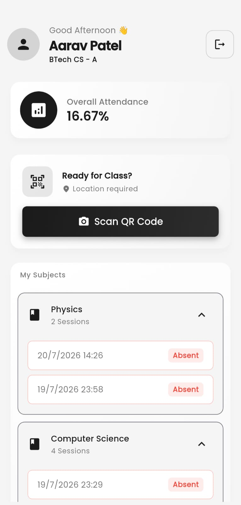
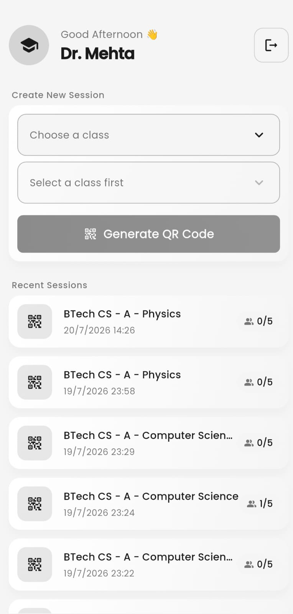
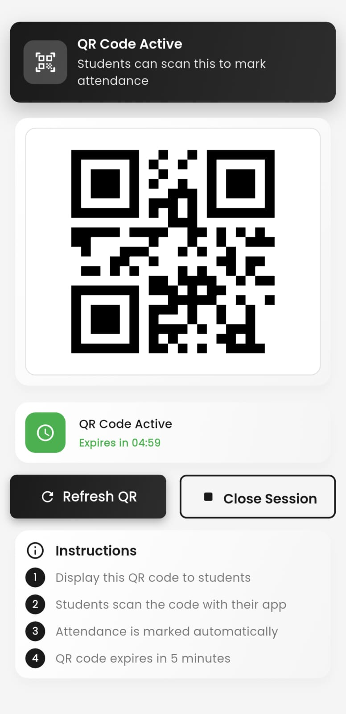

# 🎓 Smart Attendee — Smart India Hackathon App (SIH 2025)

**Smart Attendee** is a mobile attendance automation system built for **Smart India Hackathon 2025**, designed to eliminate proxy attendance using **QR codes**, **geofencing**, and **real-time analytics**.

The app includes dedicated **Teacher** and **Student** workflows and is powered by a live **Express.js + PostgreSQL backend**.  
The entire Flutter application was developed and integrated by **Utkarsh Tiwari**.

---

## 🔗 Demo Credentials (For Testing)

These demo accounts are safe and only expose sample data.

### 👩‍🏫 Faculty Login  
- Email: `faculty1@example.com`  
- Password: `faculty123`

### 👨‍🎓 Student Login  
- Email: `student1@example.com`  
- Password: `student123`

---

## 🎯 The Problem (SIH 2025 Case Study)

This project originated from **Smart India Hackathon 2025 (Problem Statement ID: 25016 - Government of Punjab)**.

**The Challenge:** Traditional college attendance is manual, time-consuming, and highly susceptible to proxy attendance. Furthermore, faculty lack real-time analytics to identify disengaged or struggling students.

**The Solution:** Smart Attendee completely automates this process. By enforcing geofenced, time-sensitive QR code scanning, it eliminates proxy attendance, saves valuable teaching time, and provides real-time, actionable insights through a comprehensive analytics dashboard.

---

## 📲 App Preview (Premium Dark Mode)

### 🔐 Authentication & Demo Access
<p align="center">
  
  &nbsp;&nbsp;&nbsp;&nbsp;
  
</p>

### 👨‍🎓 Student Dashboard & QR Scanner
<p align="center">
  
  &nbsp;&nbsp;&nbsp;&nbsp;
  
</p>

### 👩‍🏫 Teacher Dashboard & QR Generation
<p align="center">
  
  &nbsp;&nbsp;&nbsp;&nbsp;
  
</p>

### 📊 Session Complete Summary
<p align="center">
  
</p>

---

## 🎥 Demo Video

A full video tutorial showing:
- Login  
- Teacher QR generation  
- Student QR scanning  
- Attendance verification  
- Analytics overview

https://github.com/user-attachments/assets/efde8aaf-6553-415e-8bbc-b277e349a285

---

## 🎨 UI/UX Evolution (Before & After)

We recently underwent a massive UI overhaul to transition from a basic functional layout to a premium, production-ready aesthetic. 
*Note: The new UI is fully responsive and supports both Light and Dark themes.*

| Screen | Old UI (V1) | Premium UI (V2 - Light) |
|--------|-------------|-------------------------|
| **Login** |  |  |
| **Student Dashboard** |  |  |
| **Teacher Dashboard** |  |  |
| **QR Generation** |  |  |

**Key UX Upgrades:**
- **Animations:** Replaced static loading indicators with premium `Shimmer` effects and staggered slide cascades.
- **Visual Hierarchy:** Removed cluttered tabs in favor of spacious, card-based layouts.
- **Aesthetics:** Upgraded to modern gradients, glassmorphism shadows, and a cohesive dark/light typography system.
- **New Features:** Added elegant dropdowns for Demo Access and a comprehensive Session Complete summary.

---

## 🧠 Features

### 👩‍🏫 Teacher Module
- Generate **time-limited QR codes**
- Select class & subject
- Track live attendance
- End or refresh QR session
- View analytics summary

### 👨‍🎓 Student Module
- Scan QR to mark attendance
- **GPS/geofencing** enforced to prevent proxy attendance
- View attendance percentage
- Subject-wise breakdown
- Alerts (low attendance warning)

### 🔐 Shared Features
- JWT-based role authentication
- Modern Flutter UI (smooth animations)
- Secure API integration
- Cross-platform mobile compatibility

---

## 🛠️ Tech Stack

### Frontend — *Developed by Utkarsh Tiwari*
- Flutter  
- Dart  
- `mobile_scanner` (QR scanning)  
- `qr_flutter` (QR generation)  
- `geolocator` (GPS validation)  
- `shared_preferences` (JWT storage)

### Backend — *Team*
- Express.js  
- PostgreSQL  
- JWT Auth  
- Hosted on Render  

---

## ⚙️ System Architecture

```
Teacher selects class → Generates QR
        |
        v
Time-bound QR stored in backend
        |
Student scans QR → App verifies:
        - Session active?
        - QR valid and not expired?
        - Student inside geofence?
        |
        v
Backend marks attendance (PostgreSQL)
        |
Both teacher & student dashboards update analytics
```

---

## 📁 Project Structure (Frontend)

```
lib/
├── main.dart                          
├── services/                          
│   ├── attendance_service.dart        
│   ├── auth_service.dart              
│   ├── faculty_service.dart           
│   ├── location_service.dart          
│   └── student_analytics_service.dart 
├── shared/                            
│   ├── screens/
│   │   └── login_screen.dart          
│   └── widgets/                       
│       ├── custom_button.dart
│       ├── custom_card.dart
│       └── loading_indicator.dart
├── student_app/                       
│   └── screens/
│       ├── home_screen.dart           
│       └── qr_scanner_screen.dart     
├── teacher_app/                       
│   └── screens/
│       ├── teacher_dashboard_screen.dart 
│       └── qr_display_screen.dart     
└── utils/                             
    ├── constants.dart                 
    ├── responsive.dart                
    └── theme.dart                     
```

A technical Flutter developer README is available at:

```
/frontend/DEVELOPER_README.md
```

---

## 📡 Running the App Locally

```bash
git clone https://github.com/codemacUT/smart-attendee-sih-app
cd smart-attendee-sih-app/frontend
flutter pub get
flutter run
```

To switch backend URL, edit:

```
lib/utils/constants.dart
```

---

## 🔌 API Documentation  

Here is a quick overview of the available REST API endpoints. For full request/response JSON payloads, please refer to the detailed [Backend API Documentation](backend/api_endpoints.md).

### 🔐 Authentication
- `POST /auth/login` — Authenticate student/faculty & get JWT.
- `GET /auth/profile` — Fetch authenticated user profile.

### 🧑‍🏫 Faculty Attendance Controls
- `POST /attendance/generate-qr` — Create a new attendance session & generate QR.
- `POST /attendance/end-session` — End current attendance session.
- `GET /attendance/session/:id/stats` — Get present/absent breakdown for a session.

### 👨‍🎓 Student Attendance
- `POST /attendance/mark-attendance` — Mark attendance after QR scan & geolocation validation.

### 📊 Analytics
- `GET /analytics/faculty` — Get class-wise & subject-wise analytics for faculty.
- `GET /analytics/student` — Get personal attendance stats for a student.

---

## 👨‍💻 My Contribution & Project Ownership

What started as a frontend-focused hackathon contribution evolved into a complete full-stack undertaking. My contributions include:

**Frontend (Flutter):**
- Architected and developed the complete mobile application for both Student and Faculty roles.
- Implemented complex device-native features including QR scanning workflows and GPS/Geofencing validation.
- Built a premium, fully responsive UI/UX featuring staggered animations, Shimmer loaders, and dynamic Dark/Light modes.

**Backend (Express.js & PostgreSQL):**
- While the initial backend skeleton was a team effort, I took ownership to completely re-architect and expand the REST API.
- Engineered robust session management (e.g., dynamic QR session refreshing without data duplication).
- Deployed and currently maintain the live database and Express server on Render.

---

## 📄 License  
MIT License  

---

## 👥 Developed By  

**Utkarsh Tiwari**  
GitHub: https://github.com/codemacUT
