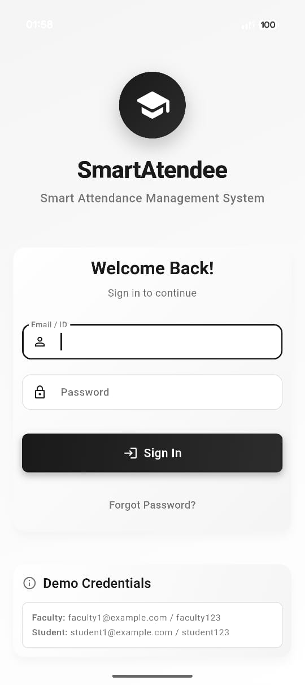
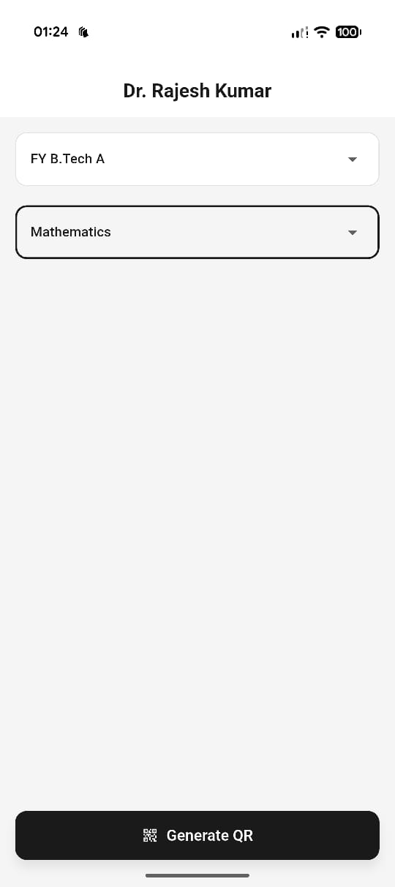
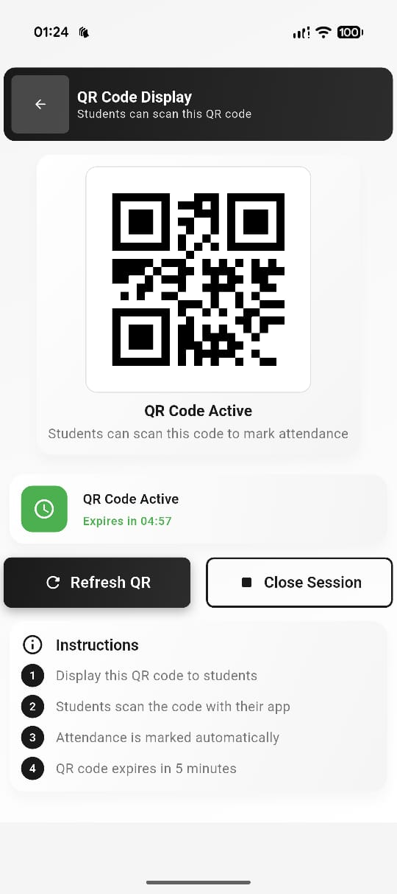
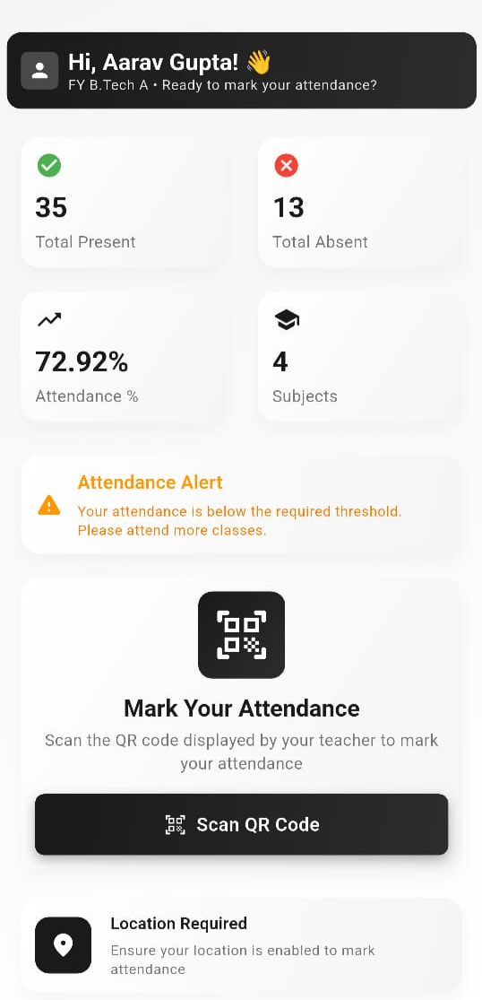
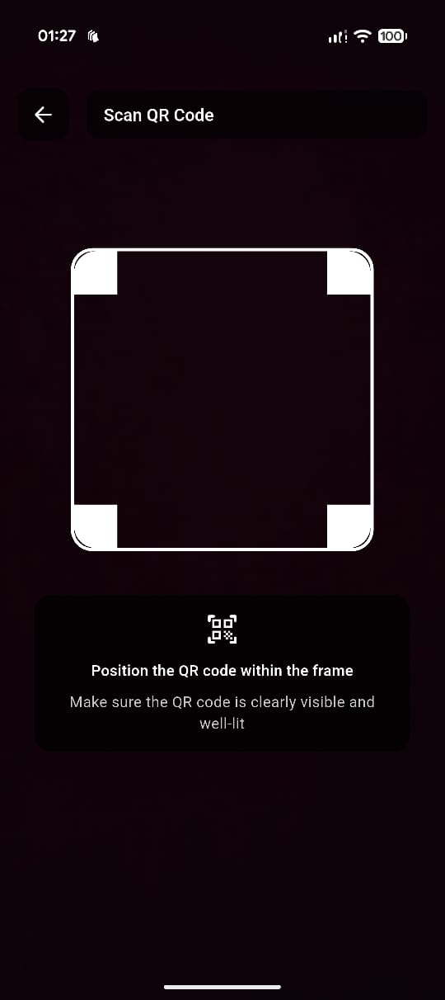

# 🎓 Smart Attendee — Smart India Hackathon App (SIH 2025)

**Smart Attendee** is a mobile attendance automation system built for **Smart India Hackathon 2025**, designed to eliminate proxy attendance using **QR codes**, **geofencing**, and **real-time analytics**.

The app includes dedicated **Teacher** and **Student** workflows and is powered by a live **Express.js + PostgreSQL backend**.  
The entire Flutter application was developed and integrated by **Utkarsh Tiwari**.

---

## 🔗 Demo Credentials (For Testing)

These demo accounts are safe and only expose sample data.

### 👩‍🏫 Faculty Login  
- Email: `faculty1@example.com`  
- Password: `faculty123`

### 👨‍🎓 Student Login  
- Email: `student1@example.com`  
- Password: `student123`

---

## 🚀 Problem → Solution (SIH Context)

Traditional college attendance is:
- time-consuming,  
- error-prone,  
- easy to manipulate (proxy attendance),  
- manually maintained.

Smart Attendee solves this by connecting **QR-based authentication** with **GPS location validation** and **real-time session monitoring**.

This project was developed under the Smart India Hackathon 2025 problem statement:  
**“Automated attendance monitoring system for educational institutions.”**

---

## 📲 App Preview (Screenshots)


### 🔐 Login  


### 👩‍🏫 Teacher – Select Class & Subject  


### 👩‍🏫 Teacher – Generate Lecture QR  


### 👨‍🎓 Student Dashboard  


### 👨‍🎓 Student – QR Scanner  


---

## 🎥 Demo Video (Coming Soon)

A full video tutorial showing:
- Login  
- Teacher QR generation  
- Student QR scanning  
- Attendance verification  
- Analytics overview  

Place your file here once ready:

```
/videos/demo.mp4
```

---

## 🧠 Features

### 👩‍🏫 Teacher Module
- Generate **time-limited QR codes**
- Select class & subject
- Track live attendance
- End or refresh QR session
- View analytics summary

### 👨‍🎓 Student Module
- Scan QR to mark attendance
- **GPS/geofencing** enforced to prevent proxy attendance
- View attendance percentage
- Subject-wise breakdown
- Alerts (low attendance warning)

### 🔐 Shared Features
- JWT-based role authentication
- Modern Flutter UI (smooth animations)
- Secure API integration
- Cross-platform mobile compatibility

---

## 🛠️ Tech Stack

### Frontend — *Developed by Utkarsh Tiwari*
- Flutter  
- Dart  
- `mobile_scanner` (QR scanning)  
- `qr_flutter` (QR generation)  
- `geolocator` (GPS validation)  
- `shared_preferences` (JWT storage)

### Backend — *Team*
- Express.js  
- PostgreSQL  
- JWT Auth  
- Hosted on Render  

---

## ⚙️ System Architecture

```
Teacher selects class → Generates QR
        |
        v
Time-bound QR stored in backend
        |
Student scans QR → App verifies:
        - Session active?
        - QR valid and not expired?
        - Student inside geofence?
        |
        v
Backend marks attendance (PostgreSQL)
        |
Both teacher & student dashboards update analytics
```

---

## 📁 Project Structure (Frontend)

```
lib/
├── main.dart                          
├── services/                          
│   ├── attendance_service.dart        
│   ├── auth_service.dart              
│   ├── faculty_service.dart           
│   ├── location_service.dart          
│   └── student_analytics_service.dart 
├── shared/                            
│   ├── screens/
│   │   └── login_screen.dart          
│   └── widgets/                       
│       ├── custom_button.dart
│       ├── custom_card.dart
│       └── loading_indicator.dart
├── student_app/                       
│   └── screens/
│       ├── home_screen.dart           
│       └── qr_scanner_screen.dart     
├── teacher_app/                       
│   └── screens/
│       ├── teacher_dashboard_screen.dart 
│       └── qr_display_screen.dart     
└── utils/                             
    ├── constants.dart                 
    ├── responsive.dart                
    └── theme.dart                     
```

A technical Flutter developer README is available at:

```
/frontend/DEVELOPER_README.md
```

---

## 📡 Running the App Locally

```bash
git clone https://github.com/codemacUT/smart-attendee-sih-app
cd smart-attendee-sih-app/frontend
flutter pub get
flutter run
```

To switch backend URL, edit:

```
lib/utils/constants.dart
```

---

## 🔌 API Documentation  
Backend routes and expected payloads are documented here:

```
/backend-info/api_endpoints.md
```

---

## 👨‍💻 My Contribution

I developed the **entire Flutter application**, including:

- full UI/UX for both roles  
- QR scanner workflow  
- GPS/geofence attendance validation  
- JWT login & authentication flow  
- all REST API integrations  
- dashboards & analytics  
- session flows (generate, scan, complete)  
- responsive design + animations  

Backend development (Express.js + PostgreSQL) was done by teammates; I integrated all endpoints and built the complete mobile client.

---

## 🏅 Smart India Hackathon (SIH) — Project Context

This application was built as part of **SIH 2025**, addressing attendance automation in higher education using modern technologies like geofencing, QR identity, and analytics dashboards.

---

## 📄 License  
MIT License  

---

## 👥 Developed By  

**Utkarsh Tiwari**  
GitHub: https://github.com/codemacUT
